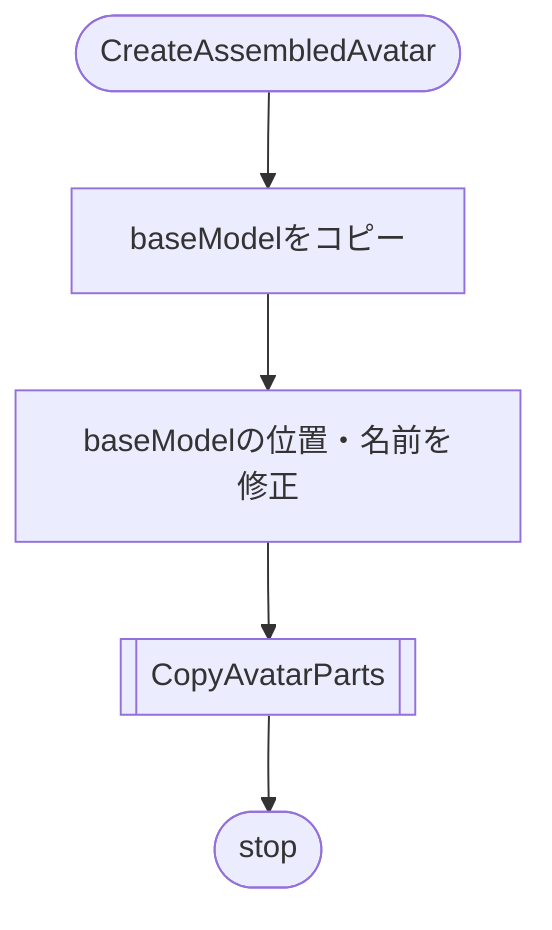
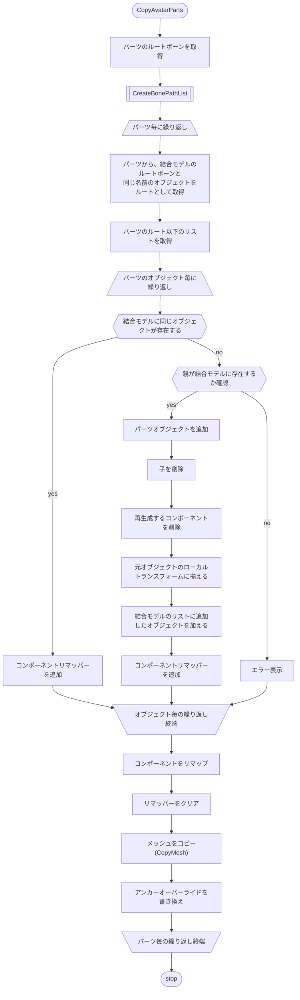
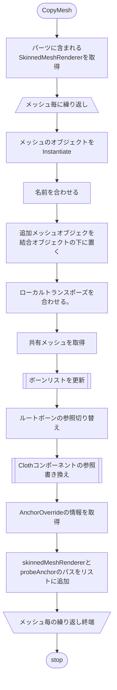

# AvatarAssembler処理フロー








```mermaid
flowchart TB
start(["ボーンリストを更新"])
--> id1[/"元のボーンリストについて繰り返し"\]
--> id2["パーツ配下のボーンパスを取得"]
--> id3["結合オブジェクトから同じパスのボーンを取得\n(見つからなければエラー)"]
--> id4["ボーンリストに追加"]
--> id5[\ボーン毎の繰り返し終端/]
--> id6["ボーンリストを差し替え"]
--> stop([stop])